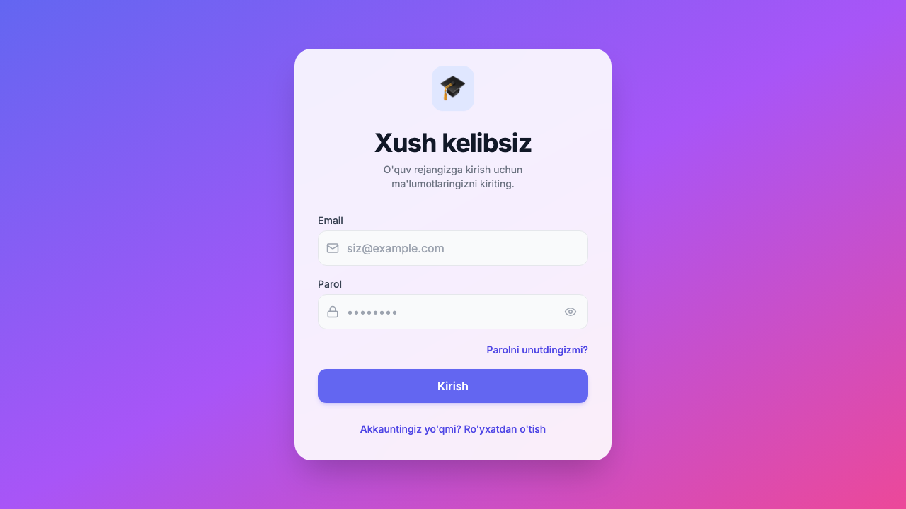

# 🎓 AI Study Planner

**[🌐 Live Demo (task-planner-tau.vercel.app)](https://task-planner-tau.vercel.app)** &nbsp;|&nbsp; Deployling & About

> **Your intelligent companion for academic success.** 🚀  
> An advanced study management platform powered by AI, designed to optimize productivity, enhance focus, and gamify the learning experience. Built for the modern student.

## 📸 Sneak Peek
<div align="center">
  
</div>

## 🛠️ Tech Stack


---

### 💡 Note on Technical Stack (Portfolio Context)
While my CV mentions **FastAPI**, **WebSockets**, and direct **PostgreSQL** under building similar realtime logic, this specific showcase project leverages **Supabase** to handle those exact backend responsibilities. Supabase provides the direct PostgreSQL database under the hood, uses its Realtime engine (built on WebSockets) for live syncing, and Edge Functions (Deno) replacing a traditional FastAPI layer to ensure faster prototyping and serverless deployment. This architecture demonstrates my ability to adapt to modern Backend-as-a-Service (BaaS) ecosystems while retaining the core principles of database design, realtime events, and AI integration.

---

[🇺🇿 O'zbek tilida qo'llanma](./docs/USER_GUIDE_UZ.md) | [📖 Documentation](./docs/)

---

## 💡 Why This Project?
Traditional to-do apps just list tasks. **AI Study Planner** goes further by understanding *what* you need to study, finding the best resources, and structuring your time using scientifically proven methods like Spaced Repetition (SRS) and the Pomodoro technique. It bridges the gap between task management, content discovery, and active recall.

**Perfect for:**
- Students managing multiple heavy coursework subjects.
- Self-taught developers or language learners needing structured curriculum generation.
- Anyone looking to gamify their focus and escape the procrastination loop.

## ✨ Core Features (Highlights)

- **🧠 AI-Powered Generation:** Instantly generate daily study schedules, curated resources (videos/articles), and Anki-style flashcards from a single keyword.
- **🎮 Gamified Focus:** Earn XP, maintain streaks, unlock achievements, and track your progress visually.
- **⚡ Deep Work Suite:** Built-in Pomodoro timer, ambient background sounds (Rain, Cafe, Forest), and session mood tracking.
- **🛠️ All-in-One Toolkit:** Drag-and-drop Kanban board, interactive calendar, rich-text markdown notes, and real-time study rooms (Jitsi Meet).
- **📱 Smart Notifications:** Telegram bot integration for daily schedules and deadline reminders.

---- **☁️ Supabase Backend**: Barcha ma'lumotlar bulutda xavfsiz saqlanadi
- **🔐 Row Level Security**: Har bir foydalanuvchi faqat o'z ma'lumotlarini ko'radi
- **🔄 Real-time Sync**: Bir necha qurilmada sinxronlash
- **💾 Offline Support**: LocalStorage orqali offline ishlash

### 📱 Telegram Bot Integratsiyasi
- **🔗 Account Linking**: Telegram akkauntni web app bilan bog'lash
- **🔔 Smart Notifications**: Ertalabki va kechki kun xabarnomalar (Schedule: 9 AM / 8 PM)
- **⏰ Deadline Reminders**: Imtihon va vazifa deadline eslatmalari (24h & 1h oldin)
- **⚙️ Sozlanadigan Vaqtlar**: Xabarnoma vaqtlarini konfiguratsiya qilish
- **🤖 Bot Commands**: `/start`, `/help` buyruqlari (Task management - kelgusida)

---

## 🚀 Texnologiyalar

### Frontend
- **React.js** (v18) - UI kutubxonasi
- **TypeScript** - Type safety
- **Vite** - Tez build tool
- **Tailwind CSS** - Styling
- **Lucide Icons** - Ikonlar

### Backend & Database
- **Supabase** - Backend-as-a-Service
  - PostgreSQL database
  - Real-time subscriptions
  - Authentication
  - Row Level Security (RLS)
  - **Edge Functions** - Telegram Bot webhook handler

### AI & Integrations
- **Google Generative AI SDK** (Gemini 2.0 Flash)
- **Jitsi Meet** - Video conferencing
- **React Big Calendar** - Kalendar
- **Recharts** - Grafiklar

### Testing & Quality
- **Vitest** - Unit testing
- **React Testing Library** - Component testing
- **ESLint** - Code quality

---

## 📦 O'rnatish to Local Setup (Quick Start)

### Option A: Standard Setup (Web Version)

**1. Repository ni Clone qiling**
```bash
git clone https://github.com/yourusername/study-planner-ai.git
cd study-planner-ai
```

**2. Dependencies ni o'rnating**
```bash
npm install
```

**3. Environment Variables ni sozlang**
`.env.example` faylidan nusxa olib, `.env` faylini yarating:
```bash
cp .env.example .env
```
Keyin `.env` faylini o'zingizning API kalitlaringiz bilan to'ldiring.

**4. Database Schema ni o'rnating**
Supabase SQL Editor da `database_schema_fixed.sql` faylini ishga tushiring.

**5. Ishga tushirish**
```bash
npm run dev
```

### Option B: Local Offline Setup (Docker + Ollama/Gemini)
Loyihani to'liq local va offline ishlatish uchun:

**1. Docker va Ollama ni o'rnating**
- Docker Desktop
- [Ollama](https://ollama.ai/) (Local AI xususiyatlari uchun)

**2. Modellarni yuklab oling**
```bash
ollama run llama3.2  # Yoki qwen2.5-coder kabi boshqa model
```

**3. Docker yordamida ishga tushiring (Tez orada)**
```bash
# Agar root da docker-compose.yml mavjud bo'lsa
docker-compose up -d --build
```
*Eslatma: Docker orqali ishga tushirishda backend servislari ajratilgan bo'lishi talab etiladi.*

---

## 🏗️ Build va Deploy

### Production Build
```bash
npm run build
```

Build fayllari `dist/` papkasida bo'ladi.

### Preview
```bash
npm run preview
```

---

## 🧪 Testing

### Barcha testlarni ishga tushirish
```bash
npm test
```

### Test Coverage
```bash
npm run test:coverage
```

---

## 📁 Loyiha Strukturasi

```
study-planner-ai/
├── src/
│   ├── components/          # React komponentlar
│   │   ├── ui/             # UI primitives (Button, Card, etc.)
│   │   └── ...             # Feature komponentlar
│   ├── pages/              # Sahifa komponentlari
│   ├── context/            # React Context (Global state)
│   ├── utils/              # Utility funksiyalar
│   │   ├── ai.ts          # AI integration
│   │   └── analytics.ts   # Analytics
│   ├── types/              # TypeScript types
│   └── lib/                # External libraries config
│       └── supabase.ts    # Supabase client
├── public/                 # Static assets
├── database_schema_fixed.sql  # Database schema
└── docs/                   # Documentation
```

---

## 🎯 Performance Optimizations

- ✅ **Lazy Loading**: Barcha sahifalar lazy load qilinadi
- ✅ **Code Splitting**: Bundle 5 ta chunk ga bo'lingan
  - `vendor.js` (165 KB) - React, Router
  - `supabase.js` (171 KB) - Supabase client
  - `ui.js` (643 KB) - UI libraries
  - `ai.js` (28 KB) - Gemini AI
- ✅ **Error Boundaries**: Global error handling
- ✅ **Optimized Images**: WebP format

---

## 🛡️ Xavfsizlik

- ✅ Row Level Security (RLS) Supabase da
- ✅ API keys `.env` da (git ignore)
- ✅ User authentication (Supabase Auth)
- ✅ HTTPS only (production)

---

## 🤝 Hissa Qo'shish

1. Fork qiling
2. Feature branch yarating (`git checkout -b feature/AmazingFeature`)
3. Commit qiling (`git commit -m 'Add some AmazingFeature'`)
4. Push qiling (`git push origin feature/AmazingFeature`)
5. Pull Request oching

---

## 📝 License

MIT License - [LICENSE](LICENSE) faylini ko'ring

---

## 🙏 Minnatdorchilik

- [Google Gemini AI](https://ai.google.dev/)
- [Supabase](https://supabase.com/)
- [Jitsi Meet](https://jitsi.org/)
- [Tailwind CSS](https://tailwindcss.com/)
- [Lucide Icons](https://lucide.dev/)

---

## 📞 Aloqa

Savollar yoki takliflar uchun issue oching yoki Pull Request yuboring!

---

**O'zbek tilida to'liq qo'llanma:** [USER_GUIDE_UZ.md](./docs/USER_GUIDE_UZ.md)

