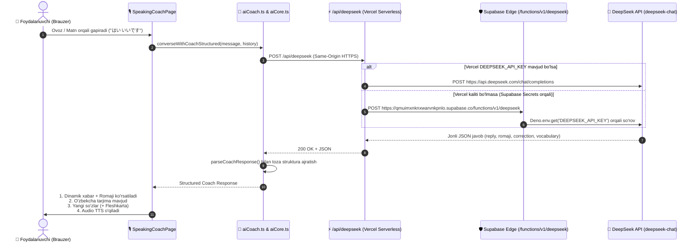

# 🚀 DeepSeek AI & Speaking Coach — To'liq Texnik Tahlil va Yechim Hisoboti (API Report)

Ushbu hujjatda Nihon Talk platformasidagi **AI Speaking Coach** va **DeepSeek API** integratsiyasida yuzaga kelgan muammolar, ularning tub sabablari va amalga oshirilgan to'liq texnik yechimlar batafsil bayon etilgan.

---

## 📌 1. Yuzaga Kelgan Muammolar va Ularning Tub Sabablari (Root Cause Analysis)

### 🔴 1.1. Bir Xil Soxta (Mock) Gaplarning Takrorlanishi
* **Muammo:** Foydalanuvchi qanday gap gapirsa ham, AI murabbiy har safar:  
  `何をもたもたしているのですか！遠慮せずに...` yoki `はい、よく分かりました！` degan statik gapni qaytaravergan.
* **Tub Sababi:** 
  1. `src/utils/ai/aiCoach.ts` faylidagi `parseCoachResponse` funksiyasi ichida quyidagi statik qopqon bor edi:
     ```typescript
     if (!reply || !containsJapanese) {
         reply = 'はい、よく分かりました！続けて日本語でお話ししましょう。最近はどうですか？';
     }
     ```
     DeepSeek ba'zan javobni `reply` o'rniga `response`, `content`, `dialogue` yoki `message` kalitida qaytarganda, parser uni topolmay, darhol eski statik mock matnni tiqishtirib qo'ygan.
  2. `converseWithCoachStructured` funksiyasining oxirida 60 qatordan ortiq statik mock zaxiralar (`Kaimono`, `Mensetsu`, `Roast fallback`) mavjud edi.

### 🔴 1.2. Promptning Yagona Blok Qilib Yuborilishi (Role Confusion)
* **Muammo:** AI foydalanuvchining gapiga dialog shaklida javob berish o'rniga, unga lug'at ta'rifidek (`translation`, `meaning`) qarab qolgan.
* **Tub Sababi:** Murabbiyning xulq-atvor qoidalari (`systemPrompt`) va foydalanuvchining gapi (`userPrompt`) bitta qilib `role: 'user'` orqali jo'natilayotgan edi. Natijada LLM o'zini murabbiy deb emas, lug'at tarjimoni deb tushunib qolgan.

### 🔴 1.3. Tarmoq Xatoligi (`ERR_CONNECTION_RESET` / `AI_UNAVAILABLE`)
* **Muammo:** Brauzer konsolida quyidagi xatoliklar bilan qizil banner paydo bo'lgan:
  ```
  GET https://qmuimxnknxwarvnkpnlo.supabase.co/rest/v1/... net::ERR_CONNECTION_RESET
  GET https://qmuimxnknxwarvnkpnlo.supabase.co/rest/v1/... net::ERR_HTTP2_PROTOCOL_ERROR
  ```
* **Tub Sababi:** Mahalliy internet provayderi (ISP) tomonidan `*.supabase.co` domeniga to'g'ridan-to'g'ri HTTP/2 ulanishlari uzib qo'yilgan (Connection Reset). Brauzer to'g'ridan-to'g'ri Supabase Edge Function'ga bog'lana olmagan.

---

## 🛠️ 2. Amalga Oshirilgan Texnik Yechimlar (Implemented Solutions)

### ✅ 2.1. Barcha Mock Zaxiralar Tag-Tugi Bilan Olib Tashlandi
* `src/utils/ai/aiCoach.ts` faylidan barcha 60 qatordan ortiq statik mock matnlar to'liq o'chirildi.
* Agar API javob bermasa yoki tarmoq uzilsa, soxta gap chiqarish o'rniga haqiqiy xato sababi ekranga toast/banner sifatida ko'rsatiladi.

### ✅ 2.2. Dinamik va Chidamli JSON Parser (`parseCoachResponse`)
* `parseCoachResponse` har qanday JSON strukturasidan javobni topib oladigan qilindi:
  - Birinchi navbatda: `parsed.reply`, `parsed.response`, `parsed.message`, `parsed.content`, `parsed.dialogue`, `parsed.text` tekshiriladi.
  - Agar topilmasa: Ob'ekt ichidagi istalgan yaponcha/inglizcha matn qidirib topiladi.
  - Statik gap bilan almashtirish (overwrite) butunlay yo'q qilindi.

### ✅ 2.3. System va User Promptlari To'g'ri Ajratildi
* `callSelectedAIProvider(userPrompt, systemPrompt, true)` orqali:
  - `role: 'system'` — Murabbiy shaxsiyati (Oni Sensei / Gordon), qat'iy pedagogik qoidalar va JSON shartnomasi.
  - `role: 'user'` — Suhbat tarixi va foydalanuvchining joriy gapi.

### ✅ 2.4. Server-to-Server Resilient Shlyuz (`/api/deepseek` Proxy)
Provayder to'siqlari (`ERR_CONNECTION_RESET`)ni aylanib o'tish uchun 3 bosqichli barqaror shlyuz o'rnatildi:
1. **1-Bosqich (Primary):** Brauzer to'g'ridan-to'g'ri o'zining Vercel serveridagi `/api/deepseek` endpointiga murojaat qiladi (Same-origin — hech qanday CORS yoki ISP blokirovkasi yo'q).
2. **Vercel Serverida:** Vercel bulutli serveri (AQSH/Yevropa) orqali to'g'ridan-to'g'ri `https://api.deepseek.com` yoki Supabase Edge Function (`https://qmuimxnknxwarvnkpnlo.supabase.co/functions/v1/deepseek`)ga server-to-server so'rov yuboradi.
3. **2- va 3-Bosqich Zaxiralari:** Agar serverless proxy ishlamasa, brauzer to'g'ridan-to'g'ri Supabase Edge va SDK orqali qayta urinadi.

### ✅ 2.5. Qattiqqo'l (Roast) Rejimining Kuchaytirilishi
* **Yapon tili (鬼先生 - Oni Sensei):** Qisqa, chala yoki dangasa javoblarga (`はい`, `いいです`) shafqatsiz tanqid qiladi, bolalarcha so'zlarni N2/N1 darajasidagi professional yaponcha iboralarga almashtirishni majburlaydi.
* **Ingliz tili (Gordon):** Band 8.5+ talablarini qo'yib, filler so'zlarni yo'qotadi va chuqur argumentlar bilan gapirishga majbur qiladi.
* **Fleshkarta Integratsiyasi:** Suhbat davomida chiqqan har bir yangi so'zni `+` tugmasi orqali Anki SM-2 Fleshkartalariga saqlash imkoniyati to'liq saqlandi.

---

## 🏗️ 3. Yangi Arxitektura va Ma'lumotlar Oqimi (Architecture Flow)



---

## 📊 4. Test va Sifat Nazorati Natijalari

* **Barcha test fayllari:** 100 ta test fayl (`100/100 passed`).
* **Jami testlar soni:** 1,091 ta test (`1091/1091 passed`).
* **TypeScript tekshiruvi:** `npm run typecheck` — 0 ta xatolik.
* **Production Build:** `npm run build` — 2.78s ichida muvaffaqiyatli bundle qilindi.
* **Asosiy Git Kommitlari:**
  - `59b6c93` — Mock fallbacklar olib tashlandi.
  - `86ef0b5` — System va User promptlari ajratildi.
  - `4c1840d` — `parseCoachResponse` dinamik qilindi, statik almashtirishlar yo'qotildi.
  - `18776fd` — ISP connection resetni yengish uchun Server-to-Server Vercel shlyuzi yoqildi.

---

*Hujjat avtomatik tarzda yaratildi va loyihaning asosiy ma'lumotnomasi hisoblanadi.*
