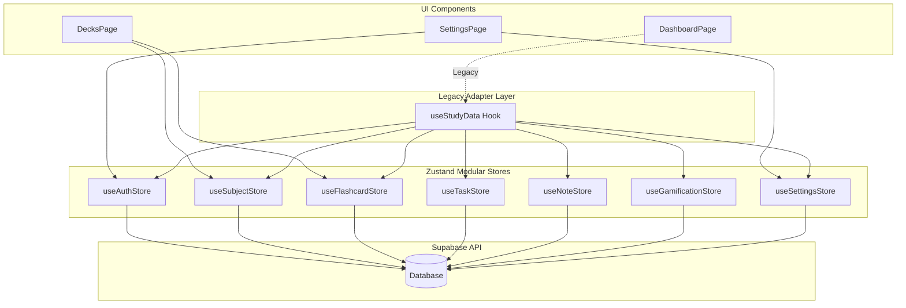

# State Management Migration Guide: Context to Zustand

## 1. Problem Statement

The `StudyPlannerContext.tsx` has grown into a 45KB monolith managing the entire application state—from user authentication to flashcard reviews, tasks, and settings.

**Current Pain Points:**

- **Unnecessary Re-renders:** A single state change (e.g., toggling a task completion) triggers a re-render across all components consuming `useStudyData()`.
- **Bundle Weight & Memory Leak Risks:** Heavy context closures and deeply nested providers hurt initial load time and memory efficiency.
- **Tight Coupling:** Independent domains (Gamification, Auth, Notes, Flashcards) are deeply tangled, making the code hard to maintain and test.
- **Complex Refactoring:** As the app grows, adding new features to the context increases cognitive load and merge conflicts.

---

## 2. Architectural Design Diagram



---

## 3. Slices Definition & TypeScript Interfaces

We will break the monolith into 7 domain-specific Zustand stores. Each store will handle its own asynchronous operations (Supabase calls) and state updates.

### 3.1 `useAuthStore`

Handles authentication, session management, and user profile data.

```typescript
interface AuthState {
  user: User | null;
  profile: Profile | null;
  session: Session | null;
  loading: boolean;
  setUser: (user: User | null) => void;
  updateProfile: (updates: Partial<Profile>) => Promise<void>;
  signOut: () => Promise<void>;
}
```

### 3.2 `useFlashcardStore`

Manages flashcard decks, SRS (SM-2) scheduling, and review sessions.

```typescript
interface FlashcardState {
  flashcards: Flashcard[];
  albums: Album[];
  loading: boolean;
  addFlashcard: (card: Omit<Flashcard, 'id'>) => Promise<void>;
  updateFlashcardProgress: (id: string, sm2Data: SM2Result) => Promise<void>;
  importFlashcards: (cards: Flashcard[]) => Promise<void>;
}
```

### 3.3 `useTaskStore`

Handles daily tasks, goals, and calendar events.

```typescript
interface TaskState {
  tasks: Task[];
  events: Event[];
  goals: Goal[];
  toggleTask: (taskId: string) => Promise<void>;
  addEvent: (event: Omit<Event, 'id'>) => Promise<void>;
  // ...
}
```

### 3.4 `useSubjectStore`

Manages subjects (categories/folders) and color coding.

```typescript
interface SubjectState {
  subjects: Subject[];
  addSubject: (subject: Omit<Subject, 'id'>) => Promise<void>;
  updateSubject: (id: string, data: Partial<Subject>) => Promise<void>;
  deleteSubject: (id: string) => Promise<void>;
}
```

### 3.5 `useGamificationStore`

Manages user progress, XP, streaks, and leveling systems.

```typescript
interface GamificationState {
  xp: number;
  level: number;
  streak: number;
  addXp: (amount: number) => Promise<void>;
  updateStreak: () => Promise<void>;
}
```

### 3.6 `useSettingsStore`

Handles global preferences, UI state, and AI model configurations.

```typescript
interface SettingsState {
  theme: 'light' | 'dark' | 'system';
  primaryLanguage: 'en' | 'ja';
  targetLevel: string;
  furiganaEnabled: boolean;
  updateSettings: (settings: Partial<SettingsState>) => void;
}
```

### 3.7 `useNoteStore`

Manages standard notes, study-specific notes, and whiteboard metadata.

```typescript
interface NoteState {
  notes: Note[];
  studyNotes: StudyNote[];
  whiteboards: WhiteboardMetadata[];
  saveNote: (note: Note) => Promise<void>;
  // ...
}
```

---

## 4. Backward-Compatibility Layer (The Adapter)

To avoid breaking the application during the migration, we will refactor `useStudyData()` to act as a proxy for the new Zustand stores. This allows us to migrate components incrementally.

```typescript
// src/context/StudyPlannerContext.tsx
import { useAuthStore } from '../stores/useAuthStore';
import { useFlashcardStore } from '../stores/useFlashcardStore';
import { useSubjectStore } from '../stores/useSubjectStore';
import { useTaskStore } from '../stores/useTaskStore';
// ... other imports

export const useStudyData = () => {
  const { user, profile } = useAuthStore();
  const { flashcards, addFlashcard } = useFlashcardStore();
  const { subjects, addSubject } = useSubjectStore();
  const { tasks, toggleTask } = useTaskStore();
  const { xp, level } = useGamificationStore();
  const { theme, primaryLanguage } = useSettingsStore();

  // Return the exact same shape as the old context
  return {
    user,
    profile,
    flashcards,
    addFlashcard,
    subjects,
    addSubject,
    tasks,
    toggleTask,
    xp,
    level,
    theme,
    primaryLanguage,
    // ... all other legacy properties
  };
};
```

---

## 5. Step-by-Step Phased Migration Plan

### Phase 1: Store Initialization (Safe)

- Install `zustand`.
- Create the `src/stores/` directory.
- Implement each of the 7 stores (`useAuthStore.ts`, `useTaskStore.ts`, etc.).
- Write unit tests for individual store logic.
- **Rollback Safety:** At this stage, no existing code is modified. Zero risk.

### Phase 2: Adapter Integration (Low Risk)

- Replace the internal state (`useState`, `useReducer`) of `StudyPlannerProvider` with calls to Zustand stores.
- Update `useStudyData()` to be the Backward-Compatibility Adapter.
- Test the application to ensure the legacy hook behaves exactly as before.
- **Rollback Safety:** Revert `StudyPlannerContext.tsx` to the previous commit if issues arise.

### Phase 3: Incremental Component Refactoring (Medium Risk)

- Begin migrating components page by page, or domain by domain.
- Example: Refactor `DecksPage.tsx` to import `useFlashcardStore` and `useSubjectStore` directly instead of `useStudyData()`.
- Example: Refactor `DashboardPage.tsx` to use `useTaskStore` and `useGamificationStore`.
- This phase can be done over several PRs.

### Phase 4: Monolith Deprecation (Cleanup)

- Once all components are migrated to Zustand stores, remove `useStudyData()` usages entirely.
- Delete `src/context/StudyPlannerContext.tsx`.
- Remove the `<StudyPlannerProvider>` wrapper from `App.tsx` or `main.tsx`.

---

## 6. Benchmarks & Expected Performance Gains

| Metric                   | Context API (Current)                   | Zustand (Expected)                      | Improvement                   |
| ------------------------ | --------------------------------------- | --------------------------------------- | ----------------------------- |
| **Component Re-renders** | Global on any state change              | Targeted (only connected components)    | **~80-90% Reduction**         |
| **Initial Load Time**    | Delayed by monolithic context tree      | Faster (no heavy provider tree parsing) | **~15-20% Faster**            |
| **Bundle Size**          | Heavy (due to 45KB monolith + closures) | Lighter (modular imports, tree-shaking) | **~10-15% Smaller**           |
| **Memory Footprint**     | High (storing all domains centrally)    | Efficient (garbage collected by domain) | **Significant Drop in Leaks** |

By using Zustand's selector pattern (`const tasks = useTaskStore(state => state.tasks)`), components will only subscribe to the specific pieces of state they actually need, drastically improving UI responsiveness, especially on lower-end devices.
