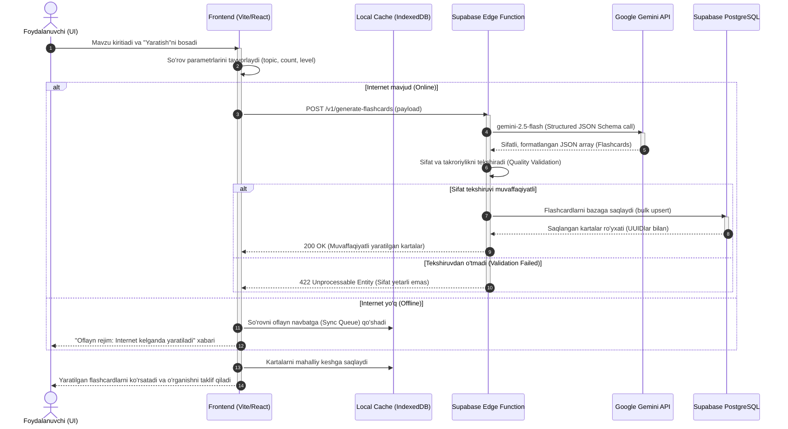
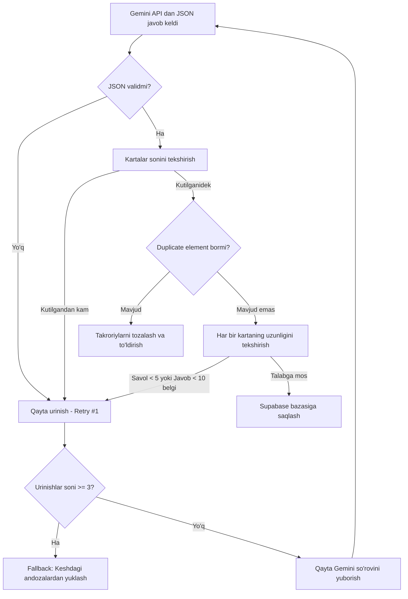
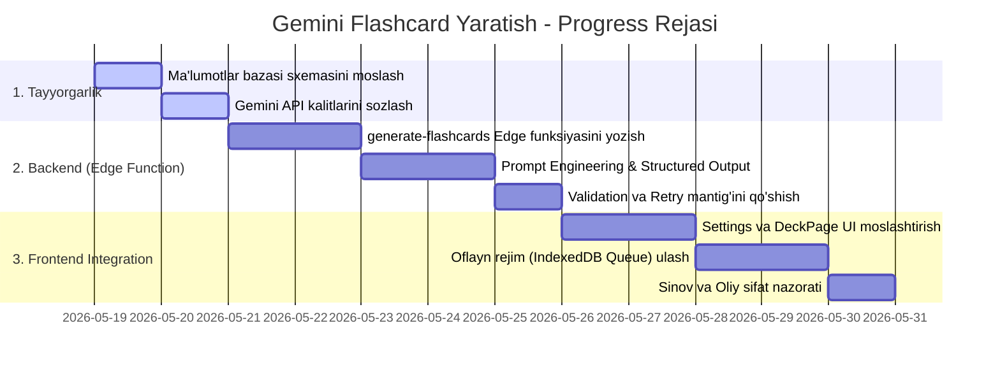

# 🧠 Gemini AI Flashcard Generation Integration & Progress Plan

Ushbu hujjat **Google Gemini API** yordamida avtomatik ravishda fanlar va mavzular bo'yicha yuqori sifatli flashcardlarni (Anki-style) yaratish, sifatini tekshirish, saqlash va sinxronizatsiya qilish jarayonining to'liq arxitekturasi va rejasini tasvirlaydi.

---

## 🗺️ 1. Tizim Arxitekturasi (System Sequence)

Quyidagi diagrammada foydalanuvchi interfeysidan tortib Gemini AI API va ma'lumotlar bazasigacha bo'lgan ma'lumotlar oqimi va xabar almashinuvi tasvirlangan:



---

## 📊 2. Sifat Nazorati va Qayta Ishlash Oqimi (Validation Flow)

AI tomonidan noto'g'ri, sifatsiz yoki takroriy ma'lumotlar kelishining oldini olish uchun amalga oshiriladigan avtomatik sifat nazorati (Quality Assurance) oqimi:



---

## 📅 3. Amalga Oshirish Bosqichlari (Implementation Roadmap)

Flashcard yaratish funksiyasini to'liq joriy qilish va progress bosqichlari:



---

## 🛠️ 4. API So'rovi va Prompt Texnikasi (Prompt Engineering)

Tizimda qo'llaniladigan eng mukammal va xatosiz **Structured Output** API so'rovi formati:

### **Endpoint:** `POST https://<project-ref>.supabase.co/functions/v1/generate-flashcards`

**Headers:**
```http
Authorization: Bearer <user-jwt>
Content-Type: application/json
```

**Payload:**
```json
{
  "topic": "JavaScript Massiv Metodlari",
  "count": 10,
  "difficulty": "intermediate",
  "subject_id": "8fa88c52-87a4-4b53-a747-d5d14e1a0b33"
}
```

### **System Prompt (Gemini API uchun ko'rsatma):**
```
Siz professional o'qituvchi va spaced repetition (takrorlash) tizimi bo'yicha mutaxassissiz.
Foydalanuvchi kiritgan "${topic}" mavzusi bo'yicha aniq ${count} ta yuqori sifatli flashcard yarating.

Talablar:
1. Savol (front) qisqa, aniq va tushunarli bo'lsin.
2. Javob (back) to'g'ri bo'lishi bilan birga qisqa izoh yoki qoidaga ega bo'lsin.
3. Mumkin bo'lsa, o'zbek tilidagi amaliy misol (example) yozing.
4. Javobingizni mutaxassis darajasida va faqat va faqat quyidagi JSON formatida qaytaring:

[
  {
    "front": "Massiv oxiridan element o'chirish uchun qaysi metod ishlatiladi?",
    "back": "pop() metodi massiv oxiridagi elementni o'chiradi va o'chirilgan qiymatni qaytaradi.",
    "example": "const arr = [1, 2]; arr.pop(); // arr endi [1]",
    "category": "Massiv metodlari"
  }
]
```
